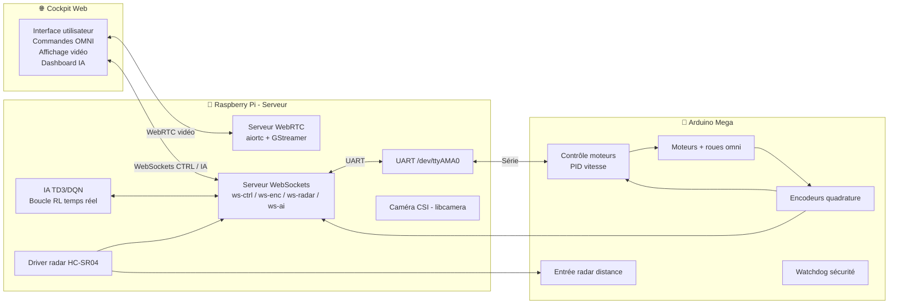

# 👋 Bienvenue

Je suis Christophe, ingénieur mécanique de formation (HES) et actuellement en formation MAS RAD à la HE-Arc. Parallèlement, je développe et expérimente des solutions Python orientées automatisation, IA modulaire et intégration DevOps, alliant mes compétences industrielles à ma passion pour les technologies numériques.

---

## 🎯 Ce que je recherche

Je souhaite rejoindre une équipe où je peux combiner :

- robotique ou mécatronique  
- IA appliquée ou automatisation intelligente  
- développement Python ou systèmes embarqués  
- projets concrets avec impact industriel  

Je suis particulièrement motivé par :
- robotique mobile  
- systèmes autonomes  
- edge AI  
- R&D technique  

---

## 🧩 Compétences clés

- Python (automatisation, IA, API, data)
- Robotique (cinématique, PID, capteurs, encodeurs)
- IA (RL, TD3/DQN, agents modulaires)
- DevOps (Docker, CI/CD GitLab)
- Web temps réel (WebRTC, WebSockets)
- Mécanique (modélisation, analyse, conception)
- Électronique embarquée (Arduino, Raspberry Pi)

---

## 💡 Pourquoi moi ?

Je combine une formation d’ingénieur mécanique avec une expertise moderne en IA, Python, robotique et DevOps.  
J’aime comprendre un système de bout en bout : mécanique, électronique, logiciel, IA.  
Je suis autonome, curieux, et j’adore construire des solutions complètes, du prototype au système fonctionnel.

---

## 📚 Sommaire

- [🔧 Stack technique globale](#-stack-technique-globale)  
- [📦 Projets techniques](#-projets-techniques)
  - [🧠 IA & Agents intelligents](#-ia--agents-intelligents)
    - [Agent_IA](#agent_ia)
    - [JSONFlow](#jsonflow)
  - [🐍 Python scientifique & modélisation](#-python-scientifique--modélisation)
    - [matAnalysis](#matanalysis)
    - [StatisticalWeather](#statisticalweather)
  - [🌐 Web, IoT & interfaces](#-web-iot--interfaces)
    - [smartphone_datas](#smartphone_datas)
    - [voltage_regulator](#voltage_regulator)
    - [AppBudget](#appbudget)
  - [🤖 Robotique & systèmes embarqués](#-robotique--systèmes-embarqués)
    - [robot_omni](#robot_omni)
- [🎯 Objectifs](#-objectifs)  
- [📫 Contact](#-contact)

---

## 🔧 Stack technique globale

### 🐍 Langages et frameworks  
  
  
  

### 🐳 Conteneurisation et CI/CD  
  
  

### 📊 Monitoring  
  
  

### 🔬 Bibliothèques scientifiques  
  
  
  

### ☕ Interfaces utilisateur  
  
  

### 🌐 Technologies Web  
  
  
  

### 🗄 Bases de données  
  
  

### 🤖 Modèles de langage  
  
  
  

---

## 📦 Projets techniques

---

# 🧠 IA & Agents intelligents

### [Agent_IA](https://github.com/Inertie78/Agent_IA)  
Assistant conversationnel modulaire avec mémoire vectorielle, recherche sémantique locale, gestion multi-utilisateurs et indexation PDF.  
**Statut** : 

### [JSONFlow](https://github.com/Inertie78/JSONFlow)  
API REST générique pour validation JSON, documentation automatique et gestion avancée des fuseaux horaires.  
**Statut** : 

---

# 🐍 Python scientifique & modélisation

### [matAnalysis](https://github.com/Inertie78/matAnalysis)  
Modélisation complète d’un mât haubané : stabilité, flambage, efforts 3D, visualisation.  
**Statut** : 

### [StatisticalWeather](https://github.com/Inertie78/StatisticalWeather)  
Analyse statistique et visualisation de données météo (projet MAS RAD).  
**Statut** : 

---

# 🌐 Web, IoT & interfaces

### [smartphone_datas](https://github.com/Inertie78/smartphone_datas)  
Interface web temps réel pour capteurs Android (orientation, GPS, boussole, batterie, etc.).  
**Statut** : 

### [voltage_regulator](https://github.com/Inertie78/voltage_regulator)  
Régulateur de tension intelligent avec interface web (projet MAS RAD).  
**Statut** : 

### [AppBudget](https://github.com/Inertie78/AppBudget)  
Application Java Swing de gestion budgétaire.  
**Statut** : 

---

# 🤖 Robotique & systèmes embarqués

### [robot_omni](https://github.com/Inertie78/robot_omni)  
Plateforme robotique omni-directionnelle complète :  
- IA TD3/DQN en temps réel  
- WebRTC faible latence  
- WebSockets (CTRL, encodeurs, radar, IA)  
- Arduino Mega (PID, moteurs, watchdog)  
- Radar ultrason + encodeurs quadrature  
**Statut** : 

#### 📸 Prototype du robot

  

#### Schéma d’architecture du robot

---

## 🎯 Objectifs

- Intégrer une équipe R&D où je peux combiner robotique, IA embarquée et développement Python.
- Concevoir des systèmes autonomes robustes, du prototype à l’intégration industrielle.
- Développer des architectures logicielles modulaires (WebRTC, WebSockets, agents IA).
- Contribuer à des projets open source liés à la robotique, l’edge AI ou l’automatisation.
- Approfondir l’IA embarquée (RL temps réel, perception, contrôle intelligent).

---

## 📫 Contact

- 📬 via [GitHub Issues](https://github.com/Inertie78/Inertie78/issues) pour toute question ou collaboration  
- 📄 CV : disponible sur demande  
- 🌐 GitHub : [github.com/Inertie78](https://github.com/Inertie78)
